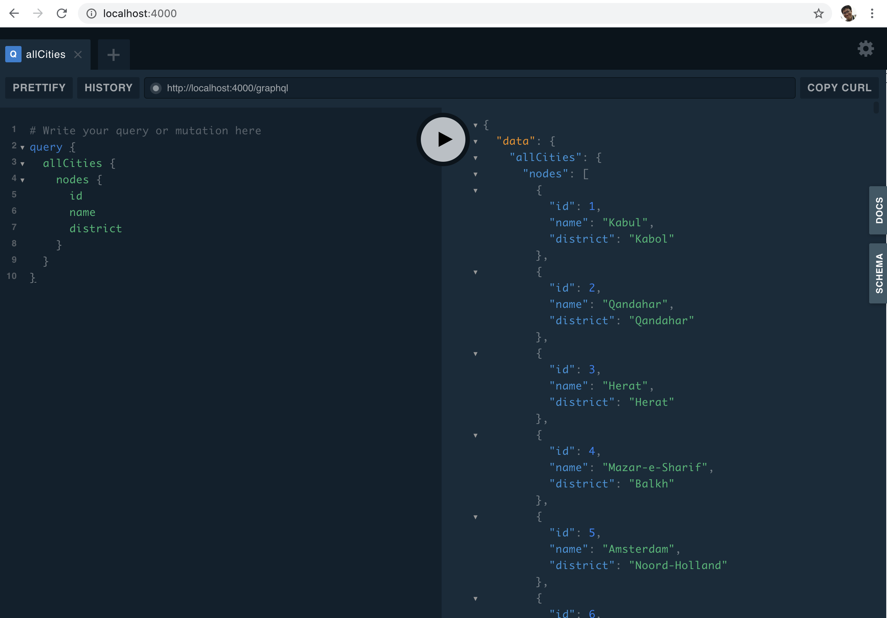

# GraphQL Mesh PostgreSQL simple example 

## TL;DR

```sh
# Run PostgreSQL on container
docker-compose up -d
# Run GraphQL Mesh
yarn install && yarn start
```

output
```
yarn run v1.22.4
$ graphql-mesh serve
info: 🕸️ => Serving GraphQL Mesh Playground: http://localhost:4000/graphql
```

Then access to `http://localhost:4000`



## Architecture

- On host
  - #1 GraphQL Mesh with node.js (port 4000)
- On Docker container
  - PostgreSQL (port 5432 mapped to host)

Behavior

- #2 runs and initializes database
- #1 accesses to #2 via 

## Issues 

I don't know why but the following structure always fails (no error came out and `yarn graphql-mesh serve` stops)
- On Docker container
  - #1 GraphQL Mesh with node.js (port 4000)
  - PostgreSQL (port 5432 mapped to host)

  ```sh
  yarn run v1.22.
  $ graphql-mesh serve                                                                                  Done in 8.18s.       
  ```